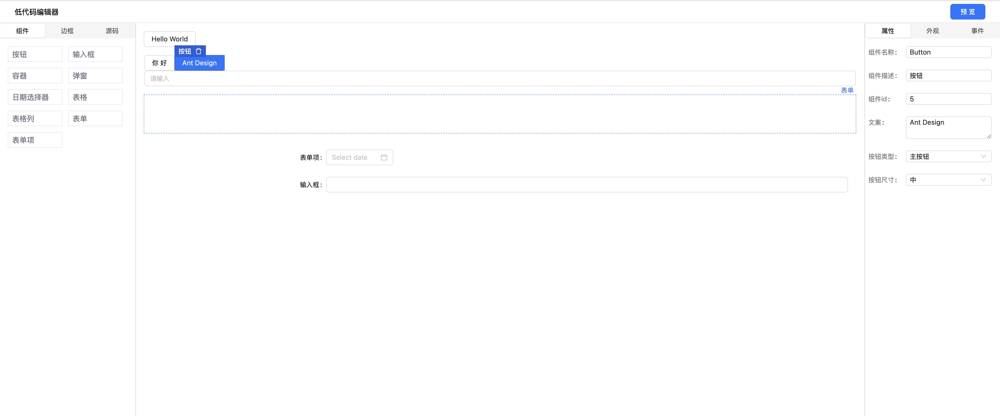

## 安装

```bash
npm install
```

## 启动

```bash
npm run dev
```

## 打包

```bash
npm run build
```

## 技术栈

- [React](https://react.dev/)
- [TypeScript](https://www.typescriptlang.org/)
- [Vite](https://vitejs.dev/)
- [Zustand](https://github.com/pmndrs/zustand)
- [Monaco Editor](https://microsoft.github.io/monaco-editor/)
- [Ant Design](https://ant.design/index-cn/)
- [React Dnd](https://react-dnd.github.io/react-dnd/)

## Done
- 布局实现
- Zustand Store
- Editor区域渲染
- 左侧materials拖拽到Editor
- Editor区域hover高亮、点击显示操作框等
- 物料组件属性设置、样式设置
- 左侧组件树展示、源码展示和预览界面
- 事件绑定
- 组件联动
- 表格组件
- 表单组件


## screenshot



## License
MIT
